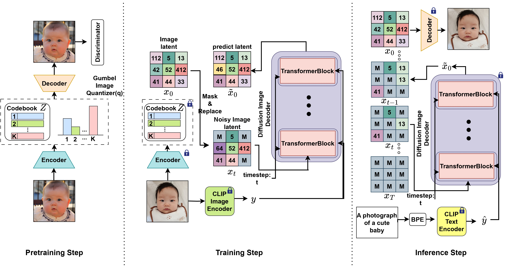

# CLIP VQ Diffusion 

## Overview



This is official repository of paper [CLIP-VQDiffusion](https://arxiv.org/abs/2403.14944)

CLIP VQ Diffusion leverage pretrained CLIP model and Vector quantized diffusion model to generate image in langauge free training setup, and achieved competative performance in FFHQ and COCO datasets.

## Requirements 
```
# python 3.8, cuda 11.2 

pip install -r requirements 

pip install git+https://github.com/openai/CLIP.git
```

## Pretrained-models 

You can download pretrained model used in papers 

pretrained visual quantizer  (Gumbel VQ-GAN)
- [COCO](https://github.com/INFINIQ-AI1/CLIPVQDiffusion/releases/download/v.0.1.0/coco_vqgan_99epoch.ckpt)
- [FFHQ](https://github.com/INFINIQ-AI1/CLIPVQDiffusion/releases/download/v.0.1.0/ffhq_vqgan_99epoch.ckpt) 

Diffusion model
- [COCO](https://github.com/INFINIQ-AI1/CLIPVQDiffusion/releases/download/v.0.1.0/clipvq_coco.pt)
- [FFHQ](https://github.com/INFINIQ-AI1/CLIPVQDiffusion/releases/download/v.0.1.0/clipvq_ffhq.pt)

place the pretrained VQ-GAN model to /OUTPUT/pretrained_model/taming_dvae/ \
place the pretrained diffusion model to /OUTPUT/pretrained_model/diffusion_models/ 


## Data Preparations 

### MS COCO 2014 Split 
```
│MSCOCO_Caption/
├──annotations/
│  ├── captions_train2014.json
│  ├── captions_val2014.json
├──train2014/
│  ├── train2014/
│  │   ├── COCO_train2014_000000000009.jpg
│  │   ├── ......
├──val2014/
│  ├── val2014/
│  │   ├── COCO_val2014_000000000042.jpg
│  │   ├── ......
```
### FFHQ 

```
FFHQ
    ├── 00000
    ├── 01000
    ├── 02000
    ├── 03000
    ├── 04000
    ├── 05000
```


## Inference using pretrained model
You can use demo.ipynb for inference and see the result.


## Training 

Training follow 3 steps. 

1. Train visual quantizer. \
training visual quantizer is not included in this repository, you can use [this repository](https://github.com/CompVis/taming-transformers) to train visual quantizer. \
we added training config in OUTPUT/pretrained_model/taming_dvae for conveinace. 

2. Train diffusion model 

```python 
#COCO 
python train.py --name coco_base_train --config_file configs/coco_base_train.yaml --num_node 1 --tensorboard 

#FFHQ 
python train.py --name ffhq_base_train --config_file configs/ffhq_base_train.yaml --num_node 1 --tensorboard 

```

3. Finetune diffusion model using classifier free guidance 

```python
#COCO 
python train.py --name coco_tune --config_file configs/coco_finetune.yaml --num_node 1 --tensorboard --load_path OUTPUT/pretrained_model/COCO_pretrained.pth 

#FFHQ
python train.py --name ffhq_tune --config_file configs/ffhq_finetune.yaml --num_node 1 --tensorboard --load_path OUTPUT/pretrained_model/FFHQ_pretrained.pth 
```
- you can change parameters of model using config file.
- you should specify approprite data directories in config file 

## Cite 

```
@misc{han2024clipvqdiffusion,
      title={CLIP-VQDiffusion : Langauge Free Training of Text To Image generation using CLIP and vector quantized diffusion model}, 
      author={Seungdae Han and Joohee Kim},
      year={2024},
      eprint={2403.14944},
      archivePrefix={arXiv},
      primaryClass={cs.CV}
}
```


## Acknowledgement 

This code is based on [VQDiffusion](https://github.com/microsoft/VQ-Diffusion) and heavily borrowed its code. \
Appreciate for sharing code. 

## License 

This project is licensed under the license in the root directory. 